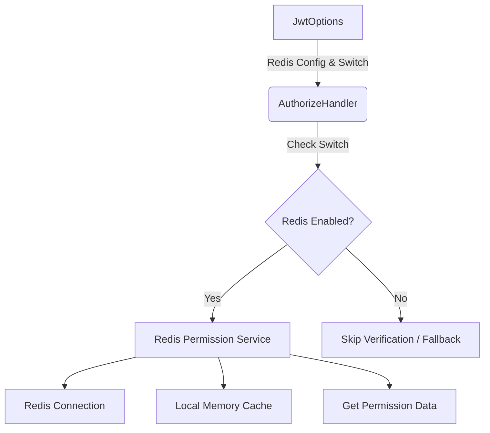

## 产品概述

将现有的基于数据库的权限验证机制迁移到基于Redis的缓存架构，提升权限验证性能并解耦数据库依赖。该计划涉及重构授权中心类库，增加Redis与本地双重缓存支持，并提供灵活的配置开关。

## 核心功能

- 将 `DatabasePermissionCheck` 从 Identity 服务迁移至 `BuildingBlocks.Authorization` 类库
- 实现基于 Redis 的权限数据缓存替代数据库直查
- 在 `JwtOptions` 中集成 Redis 连接配置及功能开关
- 创建独立的 Redis 连接管理服务与权限缓存服务
- 在 `AuthorizeHandler.IsGranted` 逻辑中增加 Redis 开关判断，未开启时跳过验证
- 增加本地内存缓存支持，形成 Redis+本地二级缓存
- 创建服务类统一管理与获取 Redis 权限配置

## 技术栈

- 核心框架：.NET (C#)
- 缓存中间件：StackExchange.Redis
- 本地缓存：IMemoryCache (Microsoft.Extensions.Caching.Memory)
- 配置管理：Options Pattern (IOptions)

## 架构设计

### 系统架构

采用**分层架构**与**策略模式**，将权限验证逻辑抽象化。

- **配置层**：JwtOptions 承载 Redis 配置与开关。
- **数据访问层**：独立的 Redis 服务封装连接与缓存操作，支持本地内存缓存作为二级缓存。
- **业务逻辑层**：BuildingBlocks.Authorization 中的 AuthorizeHandler 负责核心验证流程，根据开关决定是否执行或回退逻辑。
- **迁移层**：原 Identity 中的 DatabasePermissionCheck 移除，功能完全由新架构接管。



### 模块划分

- **BuildingBlocks.Authorization.Options**: 包含 `RedisCacheOptions` 和 `JwtOptions` 扩展，定义连接字符串、超时及开关。
- **BuildingBlocks.Authorization.Redis**: 包含 `IRedisConnectionService`（连接管理）和 `IPermissionCacheService`（权限数据读写）。
- **BuildingBlocks.Authorization.Core**: 包含 `AuthorizeHandler`，集成权限验证逻辑与缓存调用。
- **BuildingBlocks.Authorization.Local**: 包含本地缓存适配器，封装 `IMemoryCache` 操作。

### 数据流

1. 请求进入 `AuthorizeHandler.IsGranted`。
2. 检查 `JwtOptions` 中的 Redis 开关。
3. 若开启，调用 `IPermissionCacheService`。
4. 服务先查本地内存缓存，命中则返回；未命中则查 Redis。
5. Redis 返回数据后回写本地缓存。
6. 若未开启，执行跳过逻辑或回退逻辑。

## 实现细节

### 核心目录结构

```text
BuildingBlocks.Authorization/
├── Options/
│   ├── RedisCacheOptions.cs          # Redis 配置定义
│   └── JwtOptionsExtensions.cs       # 扩展 JwtOptions 集成 Redis 开关
├── Redis/
│   ├── Interfaces/
│   │   ├── IRedisConnectionService.cs
│   │   └── IPermissionCacheService.cs
│   ├── Services/
│   │   ├── RedisConnectionService.cs  # Redis 连接管理
│   │   └── PermissionCacheService.cs # 权限缓存读写逻辑（含本地缓存）
│   └── Models/
│       └── PermissionCacheItem.cs    # 缓存数据模型
├── Core/
│   └── AuthorizeHandler.cs           # 权限验证处理器（修改逻辑）
└── Local/
    └── LocalMemoryCacheAdapter.cs     # 本地内存缓存封装
```

### 关键代码结构

**RedisCacheOptions**: 定义 Redis 连接所需的配置参数及功能开关。

```
public class RedisCacheOptions
{
    public string ConnectionString { get; set; }
    public bool IsEnabled { get; set; } = true;
    public int SlidingExpirationMinutes { get; set; } = 30;
}
```

**IPermissionCacheService**: 定义权限缓存的统一访问接口，包含获取、设置及移除权限的方法。

```
public interface IPermissionCacheService
{
    Task<bool> IsGrantedAsync(string userId, string resource);
    Task SetPermissionAsync(string userId, string resource, bool isGranted);
}
```

**AuthorizeHandler 逻辑伪代码**:

```
public class AuthorizeHandler
{
    private readonly IPermissionCacheService _cacheService;
    private readonly JwtOptions _options;

    public async Task<bool> IsGrantedAsync(string userId, string resource)
    {
        if (!_options.RedisCache.IsEnabled) return true; // 或执行其他回退逻辑

        return await _cacheService.IsGrantedAsync(userId, resource);
    }
}
```

### 技术实施计划

1. **配置扩展**: 在 `JwtOptions` 中增加 `RedisCache` 属性。
2. **服务迁移**: 将原 `DatabasePermissionCheck` 逻辑移除，代码迁移至 `BuildingBlocks.Authorization`。
3. **缓存实现**: 实现 `PermissionCacheService`，集成 `IMemoryCache` 和 `IDatabase`。
4. **连接管理**: 创建单例模式的 Redis 连接管理器，确保连接复用。
5. **开关逻辑**: 修改 `AuthorizeHandler` 增加判断分支。

### 集成点

- **依赖注入**: 在 `IServiceCollection` 中注册 Redis 连接与缓存服务。
- **配置绑定**: 将配置文件中的 Redis 节点绑定至 `RedisCacheOptions`。
- **异常处理**: Redis 连接失败时，需决定是否降级至本地缓存或抛出异常。