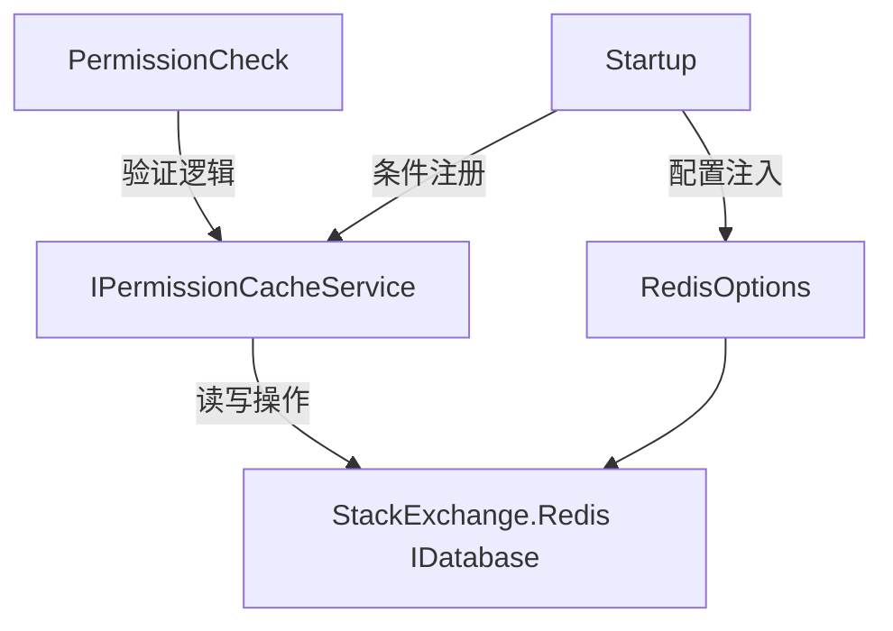

## 产品概述

重构现有Redis权限验证实现，优化代码结构和职责分离，提升配置管理的灵活性和资源使用效率。

## 核心功能

- 将权限验证逻辑从IPermissionCacheService迁移到PermissionCheck类中实现职责分离
- 替换Redis客户端库，从FreeRedis迁移至StackExchange.Redis的IDatabase接口
- 使用项目扩展方法AddConfigurationOptions和BindOptions注入配置
- 实现条件服务注册，仅在Redis配置启用时注册相关服务
- 完善IPermissionCacheService接口，增加集合数据的增、删、查方法

## 技术栈

- 开发语言: C# / .NET
- Redis客户端: StackExchange.Redis
- 配置管理: Microsoft.Extensions.Configuration
- 依赖注入: Microsoft.Extensions.DependencyInjection

## 架构设计

### 系统架构

重构采用分层架构和职责分离原则，将验证逻辑与缓存操作分离。



### 模块划分

- **PermissionCheck模块**: 负责权限验证业务逻辑，调用缓存服务获取数据并执行验证规则
- **IPermissionCacheService模块**: 仅负责Redis缓存的增删查操作，处理集合数据读写
- **配置模块**: 使用扩展方法封装配置绑定逻辑
- **服务注册模块**: 实现基于配置的条件服务注册

### 数据流

验证请求 → PermissionCheck验证逻辑 → 调用IPermissionCacheService → 通过IDatabase操作Redis → 返回集合数据 → PermissionCheck完成验证

## 实现细节

### 目录结构

```
LexiCraft/
├── Services/
│   ├── PermissionCheck.cs          # 修改：添加验证逻辑
│   └── IPermissionCacheService.cs # 修改：增加集合操作方法
├── Extensions/
│   └── RedisServiceCollectionExtensions.cs  # 新增：配置注入和条件注册
├── Configuration/
│   └── RedisOptions.cs            # 新增：配置选项类
└── Redis/
    └── RedisPermissionCacheService.cs # 新增或修改：实现IDatabase操作
```

### 关键代码结构

**IPermissionCacheService接口**：定义缓存操作方法

```
public interface IPermissionCacheService
{
    Task<HashSet<string>> GetPermissionSetAsync(string key);
    Task AddToSetAsync(string key, string value);
    Task RemoveFromSetAsync(string key, string value);
}
```

**RedisOptions配置类**：Redis连接配置

```
public class RedisOptions
{
    public string ConnectionString { get; set; }
    public bool Enabled { get; set; }
}
```

**扩展方法**：配置注入和服务注册

```
public static class RedisServiceCollectionExtensions
{
    public static IServiceCollection AddRedis(this IServiceCollection services, IConfiguration configuration)
    {
        var options = configuration.AddConfigurationOptions<RedisOptions>("Redis");
        
        if (options.Enabled)
        {
            services.AddSingleton<IConnectionMultiplexer>(sp => 
                ConnectionMultiplexer.Connect(options.ConnectionString));
            services.AddSingleton<IPermissionCacheService, RedisPermissionCacheService>();
        }
        
        return services;
    }
}
```

## 技术实施计划

1. **问题陈述**: 需要将验证逻辑与缓存操作分离，并替换Redis客户端库
2. **解决方案**: 重构PermissionCheck承担验证职责，IPermissionCacheService仅操作IDatabase
3. **关键技术**: StackExchange.Redis、依赖注入、扩展方法、条件注册
4. **实施步骤**:

- 创建RedisOptions配置类
- 实现扩展方法AddConfigurationOptions和BindOptions
- 重构IPermissionCacheService增加集合操作方法
- 迁移验证逻辑到PermissionCheck
- 实现条件服务注册

5. **测试策略**: 单元测试验证逻辑，集成测试Redis连接和操作

## 集成点

- 配置系统：通过IConfiguration读取Redis配置
- 依赖注入容器：使用IServiceCollection注册服务
- StackExchange.Redis：通过IDatabase接口与Redis交互

## Agent Extensions

### SubAgent

- **code-explorer**
- Purpose: 探索现有代码结构，查找PermissionCheck和IPermissionCacheService的当前实现
- Expected outcome: 定位需要修改的文件和方法，理解现有数据流和依赖关系