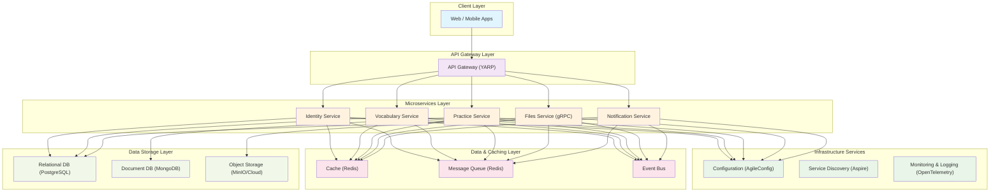

# LexiCraft

LexiCraft 是一个现代化的、基于 .NET 的微服务学习平台，采用 .NET Aspire 进行服务编排。该项目旨在通过清晰的职责分离和现代架构模式来构建可扩展、可维护的应用程序。

## 项目特点

- **微服务架构**: 采用微服务设计模式，服务间松耦合，易于扩展和维护
- **现代化技术栈**: 基于 .NET 10.0 预览版，使用最新的技术和框架
- **多数据库支持**: 结合使用 PostgreSQL（关系型数据）和 MongoDB（文档存储）
- **分布式缓存**: 集成 Redis 以提高系统性能和响应速度
- **API 网关**: 使用 YARP 作为反向代理和 API 网关
- **事件驱动**: 采用事件总线实现服务间异步通信
- **集中配置**: 使用 AgileConfig 进行统一配置管理

## 架构概览

LexiCraft 采用分层的微服务架构，包含以下几个关键组件：



### 微服务组件

- **Identity Service**: 用户身份认证和管理服务，包含用户、权限、登录等核心功能
  - 用户注册、登录、密码管理
  - JWT 令牌生成与验证
  - OAuth 第三方登录集成 (GitHub, Gitee)
  - 权限管理和角色分配

- **Vocabulary Service**: 词汇管理服务，处理词汇相关的业务逻辑
  - 词汇数据的增删改查
  - 词汇分类和标签管理
  - 词汇搜索和过滤功能
  - 学习计划制定

- **Practice Service**: 练习模块服务，使用 MongoDB 存储练习数据
  - 练习题目的创建和管理
  - 用户练习进度跟踪
  - 学习分析和统计
  - 个性化推荐算法

- **Files Service**: 文件管理服务，通过 gRPC 提供文件上传、下载等功能
  - 文件上传和存储管理
  - 文件类型验证和安全检查
  - 文件访问权限控制
  - 支持多种对象存储后端 (阿里云、腾讯云、MinIO)

- **Notification Service**: 通知服务，处理各类消息推送
  - 邮件和短信通知
  - 推送通知
  - 事件通知处理

### 基础组件 (Building Blocks)

- **BuildingBlocks**: 核心领域逻辑、仓库和异常处理
- **BuildingBlocks.Authorization**: 授权相关组件，包括 JWT 处理和权限检查
- **BuildingBlocks.Caching**: 统一缓存管理组件，支持 Redis 等缓存实现
- **BuildingBlocks.EntityFrameworkCore**: 基于 EF Core 的数据访问组件
- **BuildingBlocks.EntityFrameworkCore.Postgres**: PostgreSQL 数据库相关组件
- **BuildingBlocks.Grpc.Contracts**: 用于服务间通信的 gRPC 契约
- **BuildingBlocks.OpenApi**: OpenAPI (Swagger/Scalar) 相关配置和组件
- **BuildingBlocks.EventBus**: 统一事件总线实现，支持本地内存 (Channel) 与 Redis 分布式混合模式
- **BuildingBlocks.SerilogLogging**: 基于 Serilog 的统一日志记录组件
- **BuildingBlocks.Validation**: 请求验证相关组件，基于 FluentValidation
- **BuildingBlocks.OSS**: 对象存储服务 (OSS) 统一封装组件，支持阿里云、腾讯云、Minio 等
- **BuildingBlocks.MongoDB**: MongoDB 数据访问组件

## 技术栈

### 核心框架
- **.NET 10.0** (Preview) - 应用程序运行时
- **ASP.NET Core** - Web API 和 MVC 框架
- **Entity Framework Core** - ORM 框架
- **MediatR** - CQRS 和中介者模式实现
- **FluentValidation** - 请求验证框架

### 数据存储
- **PostgreSQL** - 主要的关系型数据库
- **MongoDB** - 文档数据库，用于非结构化数据存储
- **Redis** - 分布式缓存和会话存储

### 通信与集成
- **gRPC** - 高效的服务间通信协议
- **YARP** - 反向代理和 API 网关
- **JWT** - 无状态身份验证

### 工具与库
- **Serilog** - 结构化日志记录
- **AgileConfig** - 集中配置管理
- **Mapster** - 对象映射
- **Polly** - 弹性和瞬态故障处理
- **OpenTelemetry** - 可观察性

## 功能特性

- **身份认证**: 通过 Identity 服务实现用户注册、登录、权限管理等功能
- **OAuth 集成**: 支持 GitHub、Gitee 等第三方登录
- **文件管理**: 通过 gRPC 提供高效的文件上传和管理功能
- **缓存机制**: 集成 Redis 缓存以提高系统性能
- **API 版本控制**: 支持 API 版本管理，便于系统演进
- **CQRS 模式**: 使用 MediatR 实现命令查询职责分离
- **请求验证**: 使用 FluentValidation 实现请求参数验证
- **事件驱动与数据一致性**:
  - 通过事件总线实现服务间的异步通信
  - 采用 **Saga 模式 (Choreography)** 处理跨微服务的分布式事务。当某个业务环节失败时，通过 `BuildingBlocks.EventBus` 发布补偿事件，确保数据的最终一致性

## 快速开始

### 先决条件

- .NET SDK 10.0+ (Preview)
- Docker（用于运行 Redis、PostgreSQL 等依赖项）
- Visual Studio 2022 Preview 或 JetBrains Rider (支持 .slnx 格式)

### 运行应用程序

1. 克隆项目：
   ```bash
   git clone https://github.com/your-username/LexiCraft.git
   cd LexiCraft/src
   ```

2. 在您首选的 IDE 中打开 `LexiCraft.slnx` 解决方案文件。

3. 将 `LexiCraft.Aspire.Host` 设置为启动项目。

4. 运行项目。这将启动 Aspire 仪表板和所有注册的服务。

### Docker 部署

1. 构建并运行所有服务：
   ```bash
   cd src
   docker compose up -d --build
   ```

2. 访问 Aspire 仪表板（通常在 http://localhost:18888）

## 部署选项

LexiCraft 支持多种部署策略：

1. **单栈 Docker Compose** (开发/测试环境):
   ```bash
   cd src
   docker compose up -d --build
   ```

2. **蓝绿部署** (生产环境，零停机):
   - Blue 栈: `APIGATEWAY_PORT=5000 docker compose -p lexicraft_blue up -d --build`
   - Green 栈: `APIGATEWAY_PORT=5001 docker compose -p lexicraft_green up -d --build`

3. **Docker Swarm** (多节点环境):
   ```bash
   cd src
   docker stack deploy -c compose.yaml lexicraft
   ```

4. **Kubernetes** (生产环境):
   - 为每个服务创建 Deployment 和 Service
   - 使用滚动更新策略

## 项目结构

```
src/
├── ApiGateway/                    # 基于 YARP 的 API 网关
├── BuildingBlocks/                # 共享库和组件
│   ├── BuildingBlocks/            # 核心领域逻辑
│   ├── BuildingBlocks.Authorization/ # 授权组件
│   ├── BuildingBlocks.Caching/    # 缓存组件
│   ├── BuildingBlocks.EntityFrameworkCore/ # EF Core 组件
│   ├── BuildingBlocks.EntityFrameworkCore.Postgres/ # PostgreSQL 组件
│   ├── BuildingBlocks.EventBus/   # 事件总线
│   ├── BuildingBlocks.Grpc.Contracts/ # gRPC 契约
│   ├── BuildingBlocks.MongoDB/    # MongoDB 组件
│   ├── BuildingBlocks.OpenApi/    # OpenAPI 组件
│   ├── BuildingBlocks.OSS/        # 对象存储服务
│   ├── BuildingBlocks.SerilogLogging/ # 日志记录
│   └── BuildingBlocks.Validation/ # 验证组件
├── LexiCraft.Aspire.Host/         # .NET Aspire 主机项目
├── LexiCraft.Aspire.ServiceDefaults/ # Aspire 服务默认配置
├── microservices/                 # 微服务集合
│   ├── Identity/                  # 身份认证服务
│   ├── Vocabulary/                # 词汇服务
│   └── Practice/                  # 练习服务
├── UIs/                           # 前端应用程序
├── compose.yaml                   # Docker Compose 配置
├── Directory.Build.props          # 全局 MSBuild 属性
├── Directory.Packages.props       # 集中包管理
└── global.json                    # .NET SDK 版本规范
```

## 测试策略

- **单元测试**: 使用 xUnit 框架
- **集成测试**: 使用 Testcontainers 进行数据库集成测试
- **契约测试**: 确保服务间接口兼容性
- **端到端测试**: 验证完整用户流程

## 监控与可观测性

- **日志记录**: 使用 Serilog 进行结构化日志记录
- **指标收集**: 集成 OpenTelemetry 收集性能指标
- **分布式追踪**: 跨服务请求追踪
- **健康检查**: 为所有服务实现健康检查端点

## 贡献

我们欢迎社区贡献！请查看 [CONTRIBUTING.md](CONTRIBUTING.md) 了解如何开始。

## 许可证

本项目采用 MIT 许可证 - 详见 [LICENSE](LICENSE) 文件。

## 支持

如果您有任何问题或需要帮助，请：
- 查看我们的 [文档](docs/)
- 提交 [Issue](https://github.com/your-username/LexiCraft/issues)
- 加入我们的讨论

---

*此 README 是根据项目实际结构和功能生成的。*