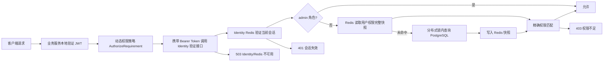

# BuildingBlocks.Authorization 权限重构代码审查

- 审查日期：2026-08-12
- 审查范围：`BuildingBlocks.Authorization`、Identity 权限与会话、Practice/Vocabulary/Files 接入、Redis 命名实例、Aspire/Compose 配置、Identity 数据迁移
- 审查结论：**通过，具备合并条件；上线前仍需完成真实环境的端到端验证，并处理本文列出的边界风险。**

## 1. 重构目标与最终边界

本次重构采用“本地认证、Identity 集中授权”的多服务模型：

1. Identity、Practice、Vocabulary、Files 都在本服务内完成 JWT 签名、签发者、受众和过期时间验证。
2. Identity 是当前会话和用户权限的唯一权威来源：
   - 当前会话保存在 Identity 专用 Redis 命名实例中；
   - 用户权限以 PostgreSQL 为持久化真相，以 Redis 完整快照为缓存；
   - Identity 通过 `POST /api/v1/identity/permissions/validate` 同时验证当前 Bearer Token 会话与权限。
3. Practice、Vocabulary、Files 不再直接读取权限 Redis，而是携带原始 Bearer Token 调用 Identity 验证接口。
4. 权限树由 `LexiCraft.Shared` 中唯一的 `LexiCraftPermissionDefinitionProvider` 注册，所有服务使用同一份定义。
5. 权限判定使用**精确权限匹配**；父节点只用于权限树展示和页面分组，不再隐式授予全部子权限。
6. 管理员旁路依据持久化的 `admin` 角色，不再依据用户名或账号字符串。

## 2. 原实现确认的问题与修复

| 原问题 | 风险 | 本次处理 |
| --- | --- | --- |
| 各服务各自注册权限定义 | Identity 无法保证了解其他服务的完整权限树，定义可能漂移 | 删除服务内分散 Provider，统一为 `LexiCraftPermissionDefinitionProvider` |
| Practice/Vocabulary 直接读取权限 Redis | 业务服务耦合 Identity 存储结构，无法统一会话语义 | 改为调用 Identity 权限验证接口；业务服务只做本地 JWT 验证 |
| 父权限可隐式授予任意子权限 | 旧默认 `Pages` 实际可放大为全部权限，包括导入、权限管理等高风险操作 | 改为精确匹配；迁移为旧默认用户补齐正常业务叶子权限 |
| 以用户名 `admin` 作为管理员旁路 | 用户名变化、大小写或账号冒用可能造成越权 | 改为持久化角色；JWT 携带角色，`admin` 角色旁路 |
| Redis 保存原始 access/refresh token | Redis 泄漏会直接泄漏可使用令牌 | Redis 键和值只保存 SHA-256 哈希和用户/会话指针；新格式使用 `authorization:v2:*` 键空间，避免与旧值类型碰撞 |
| 登录、刷新、登出在多实例下无串行化 | 并发刷新和登录可能产生多个“当前会话”或旧令牌复活 | 对用户会话、刷新令牌和权限变更使用 Identity 专用 Redis 分布式锁 |
| 权限缓存带进程内本地副本 | 多实例失效无法同步，可能继续放行已撤销权限 | 权限缓存只使用 Redis，不保留进程内副本 |
| 空权限集合无法区分“缓存未命中” | 无权限用户持续穿透数据库 | Redis 缓存完整快照，包括空集合 |
| Redis 故障与“权限不足”混为一谈 | 基础设施故障可能错误返回 403，掩盖故障 | 明确区分 401、403、503；授权依赖不可用时 fail closed 并返回 503 |
| OAuthRedis 命名实例覆盖全局 Redis 超时设置 | 授权 Redis 的数据库和超时可能污染其他缓存实例 | 命名连接字符串显式参数优先，全局默认只补未配置项 |
| 权限写接口可写入未注册名称和重复记录 | 拼写错误形成永久脏数据，重复记录增加歧义 | 写入前校验统一权限树；数据库增加 `(user_id, permission_name)` 唯一索引和长度约束 |
| Files 版本化 HTTP 门面未鉴权 | 上传、删除、内容读取可绕过权限系统 | 8 个版本化 HTTP 端点全部绑定 Files 权限 |

## 3. 权限注册与判定审查

### 3.1 注册完整性

统一 Provider 当前包含：

- Identity：用户查询/创建/编辑/删除/头像，权限查询/新增/修改/删除，失败事件重放；
- Practice：任务创建/查询/完成，评估创建/查询/更新/提交；
- Vocabulary：单词查询/导入，词库查询，学习状态查询/更新；
- Files：文件查询/内容读取/上传/创建文件夹/删除。

`PermissionDefinitionManager` 在启动时构造不可变权限集合，并检测跨 Provider 的重复名称。动态策略只接受已注册权限；未知策略返回未找到，权限写接口也拒绝未知权限名称。

### 3.2 默认用户权限

默认普通用户只获得完成现有正常用户流程所需权限：

- 获取/更新本人资料通过“已登录会话”控制；
- 上传头像；
- 创建和完成练习、提交答案；
- 查询单词/词库、查询和更新学习状态；
- 查询文件元数据和读取文件内容。

默认权限明确不包含：词汇导入、权限管理、事件重放、文件上传/建目录/删除等管理能力。

### 3.3 角色与数据库约束

- `User.Roles` 映射为 PostgreSQL `text[]`；
- 新用户写入 `user` 角色，管理员种子用户写入 `admin` 角色；
- 数据迁移为历史管理员账号回填 `admin`，其他历史用户回填 `user`；
- 用户权限名称最大 200 字符，并建立用户与权限名称的唯一索引；
- 旧 `Pages` 根权限用户通过迁移补齐正常用户需要的精确权限，避免切换精确匹配后无法使用正常功能。

## 4. 多服务验证链路审查

### 4.1 Identity

Identity 同时负责：

- 本地 JWT 验证；
- Redis 当前会话验证；
- 本地 PostgreSQL/Redis 权限查询；
- 登录、刷新、登出时的单会话轮换；
- 权限修改时的缓存失效和分布式串行化；
- 对其他服务提供权限验证接口。

Identity 权限验证接口本身只要求已登录，不要求某个业务权限，避免形成递归授权。它返回原始 `PermissionValidationResult`，业务服务可以可靠区分会话失效、权限不足和服务不可用。

### 4.2 Practice、Vocabulary、Files

三个业务服务均：

- 本地验证 JWT，不依赖 `Authority` 元数据拉取；
- 接受 Identity 签发令牌的受众配置；
- 统一注册完整权限树；
- 使用 `IdentityApiPermissionCheck` 转发原始 Bearer Token；
- 通过 Aspire 引用/等待 Identity，并通过环境变量注入服务地址；
- 通过 Compose 配置 Identity 依赖和容器内地址。

业务服务中未发现继续直接使用 `IAuthorizationCache`、`IPermissionCache`、OAuthRedis 会话键的代码。

## 5. 端点覆盖审查

### 5.1 已鉴权端点

- Identity：登出、事件重放、权限查询/新增/修改/删除、权限验证、本人资料、资料修改、头像上传；
- Practice：当前 3 个业务端点；
- Vocabulary：当前 6 个业务端点；
- Files：全部 8 个版本化 HTTP 端点。

本次静态审计未发现遗漏鉴权的现有版本化业务 HTTP 端点。

### 5.2 预期匿名端点

Identity 登录、注册、验证码、OAuth 发起/回调、刷新令牌仍保持匿名入口。这些端点通过自身凭据、验证码、OAuth 状态或刷新令牌完成认证，不应绑定普通 Bearer 权限策略。

### 5.3 兼容性例外

以下入口仍未绑定权限，属于明确保留的兼容边界：

1. Files `/uploads` 静态资源；
2. Files 旧 `/content` 路由，用于现有头像和公开资源 URL；
3. Files Code First gRPC 服务。

前两项只能承载公开内容，私有文件必须使用已鉴权的版本化 `content` 端点。gRPC 当前应只在内部网络使用，不应由网关直接暴露；如果未来对外开放，必须增加调用方身份和方法级授权。

## 6. Redis 实现结论

### 6.1 当前实现可接受的部分

- 只有 Identity 连接授权 Redis，业务服务不感知 Redis 数据结构；
- 授权使用独立命名实例 `OAuthRedis` 和独立逻辑数据库；
- 授权缓存关闭本地缓存、缓存锁和隐藏异常，避免跨实例脏读和错误吞掉；
- access token、refresh token 不以明文保存；
- 新会话和刷新令牌使用 `authorization:v2:*` 版本化键，旧版 `TokenResponse`/明文刷新键不会被新验证器反序列化；旧键按原 TTL 自然过期；
- 当前会话指针是刷新令牌最终有效性的权威判定，旧刷新键清理失败不会恢复旧会话；
- 权限读取采用 cache-aside，并在未命中时使用每用户分布式锁防止击穿；
- 权限变更先失效缓存，再写数据库。Redis 无法失效时拒绝写入，避免数据库已改变但其他实例继续使用旧快照；
- Redis/Identity 故障返回 503，而不是伪装成 403 或允许请求通过。

因此，**Redis 的使用方式在一致性和多实例语义上已修复主要问题，没有发现会直接导致权限绕过的已知缺陷。**

### 6.2 剩余运行风险

1. **Redis 是授权硬依赖。** Identity 的当前会话、刷新、登出和权限变更会在 Redis 不可用时 fail closed。生产环境应使用高可用 Redis、持久化、监控和故障演练。
2. **Identity 是业务授权的同步依赖。** 每个受保护业务请求会增加一次内部 HTTP 调用。应监控 Identity 延迟、连接池、超时和 503 比例，并保证多副本部署。
3. **分布式锁固定租期为 30 秒，没有自动续租。** 当前临界区操作正常应远短于 30 秒；若数据库或 Redis 长时间阻塞，锁可能过期并出现并发执行。上线后应监控临界区耗时，必要时增加续租或缩小临界区。
4. **权限 Redis 键没有环境前缀。** 当前通过专用逻辑数据库隔离；不同环境仍应使用独立 Redis 集群或不同数据库，不能让测试与生产共享同一授权数据库。
5. **权限快照 TTL 为 1 分钟。** 正常写路径会主动失效，TTL 是异常兜底。不得绕过 Identity 直接修改权限表，否则最多可能保留 1 分钟旧快照。
6. **本次键版本升级会主动终止旧会话。** 旧 access token 和旧 refresh token 不会迁移到 `authorization:v2:*`；发布后用户需要重新登录。Identity 新旧版本混合运行时会出现会话格式分裂，因此必须协调更新并重启全部 Identity 实例，不能长期滚动混跑。
7. **SHA-256 适用于高熵随机/JWT 令牌的不可逆存储。** 如需进一步抵御离线关联分析，可改为服务端密钥 HMAC；这不是当前正确性的阻塞项。

## 7. 仍需跟踪的安全边界

1. 当前多个服务仍共享对称 JWT 签名密钥。任何业务服务密钥泄漏都可能伪造 Identity 令牌；长期应迁移到 Identity 私钥签名、业务服务只持有公钥的非对称方案。
2. Identity 权限验证端点应只允许服务网络访问。仓库内 YARP `ReverseProxy` 为空，无法从仓库证明生产网关不会转发该内部端点；部署配置必须明确阻断外部访问。
3. Files 的公开静态资源、旧 `/content` 和内部 gRPC 是现阶段兼容例外，不能用于私有文件。
4. 本次没有进行真实 Aspire 环境下的登录、权限撤销、跨服务请求、Redis 故障切换端到端冒烟，因此构建和单元测试不能替代运行时验证。

## 8. 验证结果

| 验证 | 结果 |
| --- | --- |
| Authorization 单元测试 | 19/19 通过；包含旧会话键隔离回归 |
| `dotnet test src\LexiCraft.slnx --no-build` | 26/26 通过 |
| `dotnet build src\LexiCraft.slnx --no-restore` | 通过，0 warning / 0 error |
| Identity/Practice/Vocabulary/Files 定向构建 | 通过 |
| 6 个授权相关 JSON 配置解析 | 通过 |
| `.slnx`/`.csproj` XML 解析 | 通过 |
| `docker compose -f src\compose.yaml config --quiet` | 通过 |
| Files Docker build target | 通过 |
| `git diff --check` | 通过，仅有工作区换行提示 |
| 前端 Vite build | 通过，保留既有 chunk/import 警告 |
| 前端 `build-tsc` | 未通过；为仓库既有 Vue/TypeScript 错误和缺失 `vitest` 类型，本次未改前端 |
| 真实多服务 Bearer 端到端冒烟 | 未执行 |

## 9. 上线验收建议

上线前至少完成以下场景：

1. 普通用户登录后可完成 Practice、Vocabulary、Files 读操作；
2. 普通用户无法执行词汇导入、权限管理、事件重放和 Files 写/删操作；
3. 赋权、撤权后另一个 Identity/业务服务实例立即观察到结果；
4. 第二次登录后旧 access token 和旧 refresh token 均失效；
5. 并发刷新同一 refresh token 只允许一次成功；
6. Identity 不可达或授权 Redis 故障时业务服务返回 503，不返回 403，也不放行；
7. 网关无法从公网访问 Identity 内部权限验证端点和 Files gRPC；
8. 迁移前备份 Identity 数据库，并将两条授权迁移作为同一发布单元执行；
9. 协调更新并重启全部 Identity 实例，避免新旧会话格式混跑；发布后要求用户重新登录，旧 Redis 键不必清库，可按 TTL 自然过期。

## 10. 执行过程中的数据库风险记录

本次整理迁移时，执行 `dotnet ef migrations remove --no-build --force` 意外连接到了当前配置指向的 Identity 开发 PostgreSQL，并回滚了已有 `Initial` 迁移。随后已从 Git 恢复原始迁移文件，重新生成本次两条迁移，并将数据库架构重新迁移到最新版本。

**能够确认的是架构已经恢复并与当前模型一致；不能确认原开发库中的既有业务数据已经恢复。** 回滚过程可能删除原有表数据，若该开发库曾包含需要保留的数据，必须从执行前备份恢复或按其他数据源重建。后续迁移生成应使用隔离的本地空库或显式设计时连接，避免迁移维护命令命中共享开发数据库。