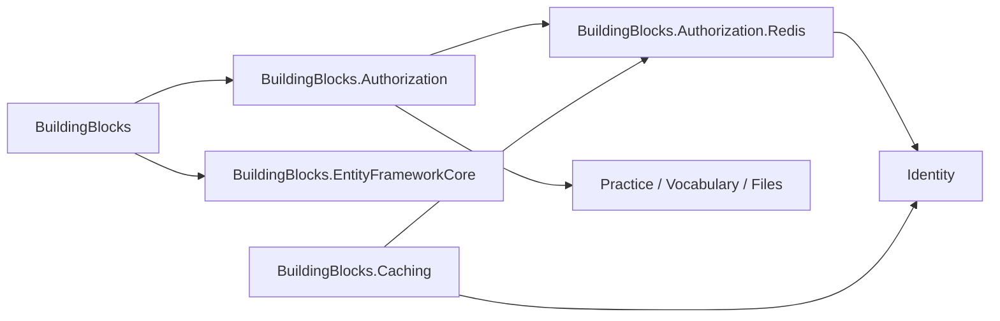

# BuildingBlocks.Authorization 重构方案设计

> 日期：2026-08-14
> 范围：授权核心、Identity Redis 适配、`IUserContext` 共享边界及各服务注册
> 原则：授权核心不依赖具体缓存技术，业务服务不感知授权 Redis，Identity 保持权限真相边界。

## 1. 目标与验收标准

1. 授权核心与 Redis 实现拆分，避免所有业务服务传递引入 StackExchange.Redis 和 MemoryPack。
2. `IUserContext` 下沉到通用核心，使 EF 审计不依赖授权类库。
3. 按 Abstractions、Contexts、Options、Permissions、Policies、Tokens、Redis Adapter 划分目录和命名空间。
4. 收紧公共 API，只公开扩展点、配置和跨类库契约。
5. 修复未知权限管理员旁路、非法 Authorization Header 转发和权限定义服务定位器问题。
6. 保持现有配置路径和 Identity/业务服务授权行为，增加回归测试并完成解决方案构建。

## 2. 调整前发现

| 优先级 | 问题 | 风险 |
| --- | --- | --- |
| P0 | 管理员检查先于权限定义存在性检查 | 配置或拼写错误的未知权限可能被管理员旁路掩盖 |
| P0 | 业务服务将非 Bearer/空参数 Header 发往 Identity | 无效请求增加远程依赖压力，失败语义不清晰 |
| P1 | 授权核心项目直接引用缓存项目 | 所有业务服务传递引入 Redis/MemoryPack，类库边界倒置 |
| P1 | `IUserContext` 位于授权项目 | EF Core 审计为了通用用户上下文被迫依赖授权实现 |
| P1 | Redis 键和配置混入 `UserInfoConst`/`OAuthOptions` | Token 核心配置与 Redis 适配细节耦合 |
| P1 | `PermissionDefinitionManager` 注入 `IServiceProvider` | 服务定位器隐藏依赖，测试和生命周期分析困难 |
| P2 | `Contract`、`Permission`、`Shared` 等目录混合接口、实现和配置 | 文件归属和命名空间不能表达职责 |
| P2 | 多个 DI 实现类公开 | 调用方可绕过注册入口，公共 API 面积过大 |
| P2 | 项目名称 Authorization、命名空间 Authentication 不一致 | 认知成本高，但一次性重命名会扩大破坏范围 |

## 3. 目标项目边界



禁止关系：

- `BuildingBlocks.EntityFrameworkCore -> BuildingBlocks.Authorization`
- `Practice/Vocabulary/Files -> BuildingBlocks.Authorization.Redis`
- `BuildingBlocks.Authorization -> BuildingBlocks.Caching`

### 3.1 通用核心

`BuildingBlocks.Contexts.IUserContext` 是审计和授权共享的最小抽象，只包含当前用户身份信息，不引用 ASP.NET Core、Redis 或权限模型。

### 3.2 授权核心

```text
BuildingBlocks.Authorization/
├─ Abstractions/   # 跨实现接口和验证 DTO
├─ Contexts/       # ASP.NET Core UserContext 实现（internal）
├─ Extensions/     # 注册入口
├─ Options/        # JWT 和权限验证配置
├─ Permissions/    # 定义模型、扩展点和检查编排
├─ Policies/       # 动态策略、Handler、Attribute
├─ Tokens/         # JWT、哈希和 Claim 常量
└─ Properties/     # 测试程序集可见性
```

### 3.3 Redis 适配层

```text
BuildingBlocks.Authorization.Redis/
├─ Caching/          # 权限快照和授权缓存实现（internal）
├─ Sessions/         # 当前会话校验（internal）
├─ Synchronization/  # 权限写入互斥（internal）
├─ Keys/             # Identity 写入方与验证方共享键模板
├─ Options/          # Identity 专用 Redis 配置
├─ Extensions/       # AddAuthorizationRedis
└─ Properties/       # 测试程序集可见性
```

只有 `Keys`、`Options` 和注册扩展需要公开；具体实现通过核心抽象注册。

## 4. 接口与设计模式评估

### 4.1 端口与适配器

授权核心声明 `IAuthorizationCache`、`IPermissionCache`、`IAccessTokenValidator`、`IAuthorizationSynchronization` 等端口；Redis 类库实现这些端口。核心不再知道 `ICacheService`、Redis 实例名或键格式。

这是本次类库拆分的主模式，解决“业务规则依赖基础设施实现”的倒置问题。

### 4.2 策略模式

`IPermissionCheck` 有两种宿主策略：

- Identity 使用 `PermissionCheck`，从权威权限存储读取；
- 业务服务使用 `IdentityApiPermissionCheck`，调用 Identity 内部端点。

由 `AddLocalPermissionValidation<T>` 和 `AddIdentityApiPermissionValidation` 显式选择，避免一个实现通过运行时条件同时承担两种职责。

### 4.3 ASP.NET Core Policy/Handler

`AuthorizationPolicyProvider` 将权限字符串转换为 `AuthorizeRequirement`，`AuthorizeHandler` 统一执行会话和权限检查，`AuthorizeResultHandle` 统一映射 401/403/503。该方式符合 ASP.NET Core 授权模型，不需要再增加自定义中间件或业务服务过滤器。

### 4.4 Provider 聚合

权限定义使用 `IEnumerable<PermissionDefinitionProvider>` 构造不可变清单。直接依赖 Provider 集合比注入 `IServiceProvider` 更清晰：

- 构造依赖可见；
- 生命周期由 DI 容器正常管理；
- 测试可以直接传入 Provider；
- 重复权限在构建阶段立即失败。

### 4.5 Cache-aside 与关闭式失败

Identity 权限快照采用 cache-aside，并用分布式锁防止并发回源。会话和权限依赖不可用时返回 503，不允许“缓存异常时放行”。权限变更路径先失效缓存，再写数据库，避免写成功后其他实例持续使用旧快照。

## 5. 已完成修改

1. 新建 `BuildingBlocks.Authorization.Redis` 并迁移四个 Redis 实现。
2. 授权核心移除对 `BuildingBlocks.Caching` 的项目引用。
3. `IUserContext` 移到 `BuildingBlocks/Contexts`，EF Core 移除授权项目引用。
4. Redis 键迁移到 `AuthorizationRedisKeys`；Redis 配置迁移到 `AuthorizationRedisOptions`。
5. 保留配置路径 `OAuthOptions:OAuthRedis`，降低部署配置迁移风险。
6. `OAuthOptions` 只保留 JWT/Token 配置；`UserInfoConst` 只保留 Claim/Header 常量。
7. 目录和命名空间调整为 Abstractions、Contexts、Options、Permissions、Policies、Tokens。
8. DI 创建的 Handler、Check、Provider 实现和 Redis 适配实现改为 `internal`。
9. `PermissionDefinitionManager` 直接接收 Provider 集合，移除服务定位器。
10. 未知权限在管理员旁路前拒绝。
11. 业务服务对缺失、非 Bearer、空 Token Header 本地返回无效会话，不发起远程请求。
12. 删除授权核心未使用的直接 `Newtonsoft.Json` 引用。
13. Identity 引用 Redis 适配层；Practice、Vocabulary、Files 只引用授权核心。
14. 新增管理员未知权限和非法 Header 回归测试。

## 6. 兼容性与发布说明

- 配置路径不变，但配置模型所属程序集改变；仓库内调用方已同步。
- 根命名空间仍为 `BuildingBlocks.Authentication`，避免本次同时进行全仓库主命名空间迁移。
- Redis 会话键继续使用 `authorization:v2:*`；本次不再次升级键版本。
- `IUserContext` 命名空间改为 `BuildingBlocks.Contexts`，仓库内调用方已迁移。
- 具体实现类由 public 收口为 internal；标准调用方式始终是接口和扩展注册，因此仓库内无行为变化。
- 新 Redis 适配项目必须与 Identity 同步部署；业务服务不需要增加 Redis 配置。

## 7. 后续单独任务

### P1：真实授权链路与故障演练

在 Aspire 或等价集成环境验证：

1. 登录、访问、刷新、登出；
2. 权限授予/撤销后跨 Identity 副本和业务服务立即生效；
3. Redis 中断、Identity 单副本中断和网络超时时均关闭式失败；
4. 旧会话键不会被新验证器接受；
5. 记录 Identity 权限验证端点的延迟、连接复用和 503 比例。

当前单元测试和构建不构成上述运行时证明。

### P1：内部权限端点的服务身份

当前业务服务依赖网络边界保护 Identity 权限验证端点。应评估 mTLS、服务到服务 Token 或网关/服务网格策略，使端点不仅验证用户 Bearer Token，还能验证调用方是受信业务服务。

### P1：JWT 非对称签名

多个业务服务持有同一对称签名密钥会扩大密钥泄漏影响面。独立任务应迁移为 Identity 私钥签名、业务服务仅持公钥，并设计密钥轮换、`kid` 和双公钥过渡。

### P2：远程权限验证性能策略

先用指标确认每请求同步调用 Identity 的实际成本，再决定是否引入短时结果缓存、批量检查或事件驱动本地快照。任何优化必须保留会话撤销时效和关闭式失败，不能仅为减少 HTTP 调用而复制权限真相。

### P2：Token 哈希升级

当前 SHA-256 适用于高熵 JWT/随机刷新令牌。若威胁模型要求抵御离线关联分析，可迁移为带服务端密钥的 HMAC；需要键版本和双读迁移，不能原地替换导致全部会话失效。

### P2：命名空间统一

在下一主版本评估把 `BuildingBlocks.Authentication` 统一为 `BuildingBlocks.Authorization`。应通过独立迁移提交完成，不与权限行为修改混合，并提供调用方迁移清单。

### P2：配置验证完善

为 `OAuthOptions` 和 `AuthorizationRedisOptions` 增加更完整的 `ValidateOnStart`：Token 过期时间、Issuer/Audience、Secret/非对称密钥来源、Redis 超时和数据库范围。敏感值只能验证存在性，不能写入日志。
