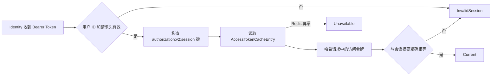

# BuildingBlocks.Authorization.Redis

`BuildingBlocks.Authorization.Redis` 是 Identity 专用的授权 Redis 适配层，为授权核心提供当前会话校验、权限快照缓存和跨实例同步。业务服务不应引用此项目；它们只引用 `BuildingBlocks.Authorization` 并通过 Identity API 远程验证权限。

为保持现有调用方兼容，公开注册扩展仍位于 `BuildingBlocks.Authentication`，Redis 类型位于 `BuildingBlocks.Authentication.Redis.*`。不要在本组件维护任务中改变这些命名空间。

## 用途与边界

本项目负责：

- 使用独立命名实例 `OAuthRedis` 连接授权 Redis。
- 读取当前用户会话中的访问令牌摘要并校验 Bearer Token。
- 缓存用户完整权限快照，包括空权限集合。
- 用每资源分布式锁串行化会话切换、缓存填充和缓存失效。
- 说明版本化会话键和刷新令牌索引键模板，并规范权限快照键格式。
- 在关键依赖不可用时关闭式失败。

本项目不负责：

- JWT 签发、JWT Bearer 参数或权限定义。
- 从 PostgreSQL 读取用户权限。
- 暴露业务服务可直接读取的 Redis API。
- 保存明文访问令牌或刷新令牌。
- 提供通用分布式事务、锁续租或 Redlock。

## 目录与依赖

| 目录 | 职责 |
| --- | --- |
| `Caching` | 纯分布式授权缓存和用户权限完整快照缓存 |
| `Extensions` | Identity 的 Redis 适配层注册入口 |
| `Keys` | 版本化会话键与刷新令牌索引键模板 |
| `Options` | `OAuthOptions:OAuthRedis` 连接配置 |
| `Sessions` | 当前 Bearer Token 与 Redis 会话摘要比较 |
| `Synchronization` | 基于授权 Redis 命名实例的短临界区分布式锁 |

项目依赖：

- `BuildingBlocks.Authorization`：授权接口、验证结果和令牌哈希辅助方法。
- `BuildingBlocks.Caching`：`ICacheService`、命名 Redis 连接和 `IDistributedLockProvider`。
- `StackExchange.Redis`：通过缓存项目提供的依赖解析连接参数。

项目启用 `GenerateDocumentationFile`，公开 options、键构造器和注册入口的 XML 注释会随程序集生成。

## Identity 注册顺序

必须按以下顺序注册：

```csharp
using BuildingBlocks.Authentication;

builder.Services.AddCaching(builder.Configuration);
builder.RegisterAuthorization();
builder.AddAuthorizationRedis();
builder.Services.AddLocalPermissionValidation<IdentityUserPermissionStore>();
```

顺序含义：

1. `AddCaching` 先注册 `ICacheService`、命名 Redis 连接能力和 `IDistributedLockProvider`。
2. `RegisterAuthorization` 注册授权核心、用户上下文和策略处理器。
3. `AddAuthorizationRedis` 注册 `IAuthorizationCache`、`IPermissionCache`、`IAuthorizationSynchronization` 和 Redis 会话验证器。
4. `AddLocalPermissionValidation<T>` 注册 Identity 的权威用户权限存储。

`AddAuthorizationRedis` 在以下情况启动即抛出 `InvalidOperationException`：

- `OAuthOptions:OAuthRedis:Enable` 不是 `true`。
- `ConnectionString` 缺失或为空。
- 尚未注册 `ICacheService` 或 `IDistributedLockProvider`，通常表示未先调用 `AddCaching`。

业务服务不要调用 `AddAuthorizationRedis`；它们应调用 `AddIdentityApiPermissionValidation()`。

## 配置 API

配置节固定为 `OAuthOptions:OAuthRedis`：

```json
{
  "OAuthOptions": {
    "OAuthRedis": {
      "Enable": true,
      "DefaultDatabase": 1,
      "ConnectTimeout": 5000,
      "SyncTimeout": 5000
    }
  }
}
```

| 属性 | 默认值 | 说明 |
| --- | ---: | --- |
| `Enable` | `false` | Identity 使用适配层时必须显式启用 |
| `ConnectionString` | `null` | Redis 连接字符串；必须从安全配置源注入 |
| `DefaultDatabase` | `0` | 授权数据使用的 Redis 逻辑数据库 |
| `ConnectTimeout` | `5000` | 建立 Redis 连接超时，单位毫秒 |
| `SyncTimeout` | `5000` | 同步命令超时，单位毫秒；同时用于异步命令超时 |

示例故意省略 `ConnectionString`。可使用环境变量层级覆盖，例如 `OAuthOptions__OAuthRedis__ConnectionString`；凭据不得写入仓库、README、日志或异常文本。

适配层把连接注册为命名实例 `OAuthRedis`。授权缓存禁用进程内缓存，仅使用分布式缓存，并设置 `HideErrors = false`，使会话和同步路径能够区分依赖故障并执行关闭式失败。

## Redis 键与令牌哈希

授权适配层使用以下当前键：

| 用途 | 模板 | 定义位置 |
| --- | --- | --- |
| 当前用户会话摘要 | `authorization:v2:session:{userIdN}` | `AuthorizationRedisKeys.Session` |
| 刷新令牌索引 | `authorization:v2:refresh:{refreshTokenHash}` | `AuthorizationRedisKeys.RefreshToken` |
| 用户权限完整快照 | `permissions:user:{userIdN}` | `RedisPermissionCache` 内部键格式 |

用户标识统一使用无连字符的 `N` 格式。刷新令牌索引的参数必须是 `AuthorizationTokenHasher.Hash` 生成的摘要，不得传入明文 Token。

旧模板 `user:login:token:{0}`、`user:login:refreshtoken:{0}` 和 `User_All_Permissions` 仅用于迁移识别或清理。当前验证器不会读取旧会话键，新写入不得使用旧格式。`authorization:v2:*` 升级会使旧会话失效，部署时需要协调全部 Identity 实例并通知用户重新登录。

Redis 会话条目使用 `AccessTokenCacheEntry` 保存访问令牌摘要和刷新令牌摘要。Redis 不保存明文 Token。SHA-256 摘要用于高熵随机令牌的等值索引，不适用于用户密码。

## 会话验证流程



`RedisAccessTokenValidator` 不记录明文 Token。用户 ID 缺失、Header 非 Bearer、参数为空、会话键不存在或摘要不匹配都返回无效会话；Redis 读取异常返回依赖不可用。调用方主动取消会继续向上传播，不会被转换为可用性结果。

## 权限快照与缓存同步

`RedisPermissionCache` 保存每个用户的完整权限集合，默认有效期为一分钟：

- 命中：返回使用 `StringComparer.Ordinal` 的权限集合。
- 未命中：返回 `null`，由 Identity 从权威权限存储读取。
- 空权限：作为有效完整快照写入，不能与未命中混淆。
- 读取或写入失败：记录错误；读取按未命中处理，由后续权威存储路径决定结果。
- 缓存失效失败：抛出带 503 状态的 `HttpRequestException`，权限变更调用方必须中止写入，防止其他实例持续使用旧快照。

典型 cache-aside 流程：

1. 读取用户权限快照。
2. 未命中时以用户资源标识获取分布式锁。
3. 锁内再次读取，避免重复回源。
4. 仍未命中时从 Identity 权威存储读取完整权限集合。
5. 写入 Redis 快照后完成精确权限检查。
6. 赋权或撤权前先使旧快照失效；失效失败则停止变更。

`RedisAuthorizationSynchronization` 使用 `OAuthRedis` 命名实例，锁 TTL 为 30 秒，获取等待上限为 5 秒。锁适合短缓存重建或会话切换临界区，没有自动续租；动作不得执行长事务或不可控外部调用。

## 异常与 HTTP 语义

| 场景 | 组件结果/异常 | 对外语义 |
| --- | --- | --- |
| Bearer Header 无效、会话不存在、摘要不匹配 | `AccessTokenValidationResult.InvalidSession` | `401 Unauthorized` |
| 会话有效但缺少权限 | 由核心权限检查返回拒绝 | `403 Forbidden` |
| Redis 会话读取失败 | `AccessTokenValidationResult.Unavailable` | `503 Service Unavailable` |
| Redis 锁不可用或获取失败 | 带 503 的 `HttpRequestException` | `503 Service Unavailable` |
| 权限缓存失效失败 | 带 503 的 `HttpRequestException` | 中止变更并返回 503 |
| 调用方取消请求 | `OperationCanceledException` 向上传播 | 遵循宿主取消语义 |

安全原则是 fail closed：Redis 故障、锁故障或无法确认会话时不得放行，也不得伪装为普通 403。生产环境应为 Redis 可用率、连接延迟、503 数量、锁等待和权限回源建立监控与告警。

## 主要公共 API

- `AuthorizationRedisOptions`：配置节、启用开关、连接字符串、数据库和超时。
- `AuthorizationRedisKeys`：当前与旧会话/刷新令牌键模板。
- `AuthorizationRedisExtensions.AuthorizationRedisInstanceName`：命名 Redis 实例名称。
- `AuthorizationRedisExtensions.AddAuthorizationRedis()`：Identity 注册入口。

缓存、会话校验和同步实现均为内部类型，由注册扩展暴露对应授权核心接口。

## 限制

- 授权 Redis 是 Identity 授权链路的硬依赖，不提供允许请求的降级模式。
- 权限快照默认 TTL 固定为一分钟；自定义过期时间只能由 `IPermissionCache` 调用方传入。
- 分布式锁没有自动续租，不是 Redlock，也不提供跨资源事务。
- 构建和单元测试不能替代真实 Redis、网络分区、多副本竞争和故障恢复验证。
- 当前会话模型只认可 Redis 指向的当前访问令牌摘要；新的登录或刷新可能使旧访问令牌立即失效。
- Redis 逻辑数据库不能替代网络隔离、访问控制、传输加密和凭据轮换。

## 构建与测试

```powershell
dotnet build src\BuildingBlocks\BuildingBlocks.Authorization.Redis\BuildingBlocks.Authorization.Redis.csproj --no-restore
dotnet test src\BuildingBlocks\BuildingBlocks.Authorization.Tests\BuildingBlocks.Authorization.Tests.csproj --no-restore
dotnet build src\Fantasy.slnx --no-restore
git diff --check
```

发布前应在真实 Aspire 或部署环境验证登录、并发刷新、登出、旧 Token 失效、权限快照命中/回源、赋权与撤权、多实例一致性，以及 Redis 断连、超时和锁竞争下的 401、403、503 语义。