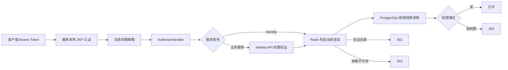

# BuildingBlocks.Authorization

LexiCraft 的授权基础设施拆分为两个类库：

- `BuildingBlocks.Authorization`：与 Redis 无关的授权核心，负责权限定义、动态策略、授权结果、JWT/用户上下文和本地/远程权限验证契约。
- `BuildingBlocks.Authorization.Redis`：Identity 专用 Redis 适配层，负责当前会话、权限快照、授权同步和授权 Redis 配置。

项目名称使用 `Authorization`，现有根命名空间暂保留 `BuildingBlocks.Authentication` 以降低一次性迁移风险；后续若统一命名空间，应作为单独主版本任务处理。

## 类库边界

| 类库/目录 | 职责 | 允许依赖 |
| --- | --- | --- |
| `BuildingBlocks/Contexts/IUserContext.cs` | 与持久化、审计和授权共享的当前用户抽象 | 仅核心 `BuildingBlocks` |
| `BuildingBlocks.Authorization/Abstractions` | Token、权限缓存、权限存储、同步和验证契约 | 核心 `BuildingBlocks`、ASP.NET Core |
| `BuildingBlocks.Authorization/Permissions` | 权限定义、定义提供程序和本地/远程检查编排 | 授权抽象 |
| `BuildingBlocks.Authorization/Policies` | 动态策略、Handler、Attribute 和失败响应 | ASP.NET Core Authorization |
| `BuildingBlocks.Authorization/Options` | JWT 与权限验证地址配置 | Options |
| `BuildingBlocks.Authorization/Tokens` | Token 生成、哈希、Claim 常量 | JWT/密码学 |
| `BuildingBlocks.Authorization.Redis` | Identity 授权 Redis 适配实现 | Authorization + Caching |

边界规则：

1. EF Core、MongoDB 和业务服务不能为了 `IUserContext` 引用授权类库。
2. Practice、Vocabulary、Files 等业务服务只引用授权核心，不引用授权 Redis 适配层。
3. 只有 Identity 引用 `BuildingBlocks.Authorization.Redis` 和 `BuildingBlocks.Caching`。
4. Redis 键模板和 Redis 配置属于适配层，不放入 JWT 核心选项或通用 Token 常量。

## 授权流程



管理员旁路只对已注册权限生效；未知权限不会因为用户具有管理员角色而放行。

## 注册方式

### 所有服务

```csharp
using BuildingBlocks.Authentication;

builder.RegisterAuthorization();
builder.Services.AddPermissionDefinitionProvider<LexiCraftPermissionDefinitionProvider>();
```

### Identity

Identity 必须先注册缓存，再注册授权 Redis 适配器，最后选择本地权限验证：

```csharp
builder.Services.AddCaching(builder.Configuration);
builder.RegisterAuthorization();
builder.AddAuthorizationRedis();
builder.Services.AddLocalPermissionValidation<IdentityUserPermissionStore>();
```

### 业务服务

业务服务选择远程 Identity 权限验证，不连接授权 Redis：

```csharp
builder.RegisterAuthorization();
builder.Services.AddIdentityApiPermissionValidation();
```

远程验证器只转发语法有效、参数非空的 Bearer Header。缺失、非 Bearer 或空 Token 在本地直接判为无效会话，不发送内部 HTTP 请求。

## 配置

JWT 配置仍位于 `OAuthOptions`：

```json
{
  "OAuthOptions": {
    "Issuer": "lexicraft-identity",
    "Audience": "lexicraft-services",
    "ExpireMinute": 30,
    "RefreshExpireMinute": 10080
  }
}
```

`Secret` 等敏感值必须来自环境变量、用户机密或部署平台密钥管理。

权限验证配置：

```json
{
  "PermissionAuthorizationOptions": {
    "AdministratorRole": "admin",
    "IdentityApiBaseAddress": "https+http://lexicraft-identity-api",
    "IdentityApiValidationPath": "/api/v1/identity/permissions/validate"
  }
}
```

Identity 专用 Redis 配置保持原配置路径，但配置类型位于 Redis 适配层：

```json
{
  "OAuthOptions": {
    "OAuthRedis": {
      "Enable": true,
      "DefaultDatabase": 1,
      "ConnectTimeout": 5000,
      "SyncTimeout": 5000
    }
  }
}
```

`ConnectionString` 不应写入仓库示例，应通过安全配置源注入。

## 权限定义

```csharp
public sealed class LexiCraftPermissionDefinitionProvider : PermissionDefinitionProvider
{
    public override void Define(PermissionDefinitionContext context)
    {
        context.AddPermission("Vocabulary.Read", "读取词汇");
    }
}
```

`PermissionDefinitionManager` 直接接收 `IEnumerable<PermissionDefinitionProvider>`，不再通过 `IServiceProvider` 执行服务定位；重复权限名称在启动构建权限清单时失败。

## 失败语义

| HTTP 状态 | 语义 |
| --- | --- |
| `401 Unauthorized` | JWT 未认证、Bearer Header 无效或 Token 已不是当前会话 |
| `403 Forbidden` | 会话有效，但缺少一个或多个已注册权限 |
| `503 Service Unavailable` | Identity、授权 Redis 或远程权限验证依赖不可用；关闭式失败 |

授权依赖不可用不能降级为允许，也不能伪装成普通缺权限。

## Redis 会话与权限约束

- 会话键和刷新令牌索引使用 `authorization:v2:*`。
- Redis 只存访问令牌和刷新令牌哈希，不保存明文。
- 权限完整快照使用 cache-aside，并在未命中时使用每用户分布式锁防止击穿。
- 权限变更先使缓存失效；缓存失效失败时拒绝继续写入，避免跨实例持续读取旧权限。
- 授权 Redis 是 Identity 的硬依赖；生产必须提供高可用、监控和故障演练。

## 公共 API

公共契约包括：

- `Abstractions` 下的接口和验证 DTO；
- `PermissionDefinition`、`PermissionDefinitionProvider`、`PermissionDefinitionContext`；
- `ZAuthorizeAttribute`、`AuthorizeRequirement`；
- `OAuthOptions`、`PermissionAuthorizationOptions`；
- `AuthorizationTokenHasher`、`UserInfoConst`；
- Redis 适配层的 `AuthorizationRedisOptions`、`AuthorizationRedisKeys` 和注册扩展。

Policy Handler、权限检查器、Redis 缓存/会话实现、JWT Provider 和 UserContext 实现均为内部类，由扩展方法注册，不属于稳定公共 API。

## 验证

```powershell
dotnet test src\BuildingBlocks\BuildingBlocks.Authorization.Tests\BuildingBlocks.Authorization.Tests.csproj
dotnet build src\microservices\Identity\LexiCraft.Services.Identity\LexiCraft.Services.Identity.csproj --no-restore
dotnet build src\LexiCraft.slnx --no-restore
git diff --check
```

单元测试和构建不能替代真实 Redis、Identity 多副本、登录/刷新/登出及跨服务权限撤销的运行时验证。