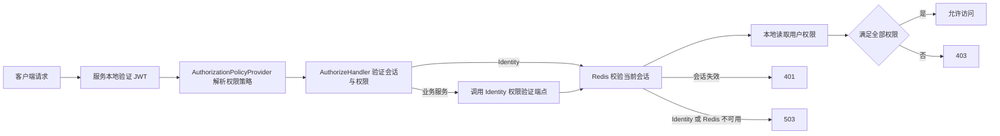

# BuildingBlocks.Authorization

`BuildingBlocks.Authorization` 是 LexiCraft 的授权基础类库，负责统一权限定义、动态策略、授权失败响应和多服务权限验证。它不替代 ASP.NET Core JWT Bearer 认证，也不负责持久化用户权限；认证、权限真相和服务边界如下：

- 所有服务先在本地验证 JWT 的签名、签发者、受众和有效期。
- `LexiCraft.Services.Identity.Api` 是当前登录会话和用户权限的唯一权威验证服务。
- Identity 从 PostgreSQL 读取用户权限，以 Redis 保存当前会话、刷新令牌索引和权限完整快照。
- Practice、Vocabulary、Files 等业务服务不读取授权 Redis，也不访问 Identity 数据库，而是转发当前 Bearer Token 到 Identity 的内部权限验证端点。

## 授权流程



授权结果明确区分三类失败：

| 状态码 | 语义 |
| --- | --- |
| `401 Unauthorized` | JWT 未认证，或 Bearer Token 已不是用户当前会话 |
| `403 Forbidden` | 会话有效，但缺少一个或多个已注册权限 |
| `503 Service Unavailable` | Identity、授权 Redis 或远程权限验证依赖不可用；系统关闭式失败，不降级放行 |

## 接入方式

### 1. 所有服务注册公共授权能力

在构建应用前同时完成 JWT Bearer 认证、授权基础设施和统一权限定义注册。实际调用顺序可按宿主现有扩展组织。

```csharp
builder.RegisterAuthorization();
builder.AddCustomAuthentication();
builder.Services.AddPermissionDefinitionProvider<LexiCraftPermissionDefinitionProvider>();
```

`RegisterAuthorization()` 只注册公共策略、处理器、用户上下文和配置，不会替调用方选择权限来源。每个宿主必须继续选择下面两种模式之一。

### 2. Identity：本地权限验证和授权 Redis

Identity API 需要先注册 `BuildingBlocks.Caching`，再注册授权 Redis 和本地权限存储：

```csharp
builder.Services.AddCaching(builder.Configuration);

builder.RegisterAuthorization();
builder.AddAuthorizationRedis();
builder.AddCustomAuthentication();
builder.Services.AddPermissionDefinitionProvider<LexiCraftPermissionDefinitionProvider>();
builder.Services.AddLocalPermissionValidation<IdentityUserPermissionStore>();
```

职责：

- `AddAuthorizationRedis()` 注册 `IAuthorizationCache`、`IPermissionCache`、`IAuthorizationSynchronization` 和 `RedisAccessTokenValidator`。
- `AddLocalPermissionValidation<TPermissionStore>()` 注册 Identity 本地 `PermissionCheck`，从 `IUserPermissionStore` 获取权威权限集合。
- Identity 的 `POST /api/v1/identity/permissions/validate` 接收业务服务传来的权限集合，并使用原始 Bearer Token 同时验证当前会话和权限。

> `AddAuthorizationRedis()` 会检查 `ICacheService` 和 `IDistributedLockProvider` 是否已经存在，调用顺序错误会在启动时抛出异常。

### 3. 业务服务：通过 Identity API 验证

Practice、Vocabulary、Files 等业务服务不注册授权 Redis，使用远程验证模式：

```csharp
builder.RegisterAuthorization();
builder.AddCustomAuthentication();
builder.Services.AddPermissionDefinitionProvider<LexiCraftPermissionDefinitionProvider>();
builder.Services.AddIdentityApiPermissionValidation();
```

`AddIdentityApiPermissionValidation()` 会：

1. 保留业务服务本地 JWT 认证；
2. 将当前请求的 `Authorization: Bearer ...` 原样转发给 Identity；
3. 调用 `PermissionAuthorizationOptions.IdentityApiValidationPath`；
4. 使用固定 5 秒 `HttpClient` 超时；
5. 把 Identity 的会话失效、权限不足和依赖不可用映射为统一授权结果。

## 权限定义与端点使用

权限必须先由 `PermissionDefinitionProvider` 注册。LexiCraft 当前使用共享的 `LexiCraftPermissionDefinitionProvider`，保证 Identity 和各业务服务识别同一份权限名称。

```csharp
public sealed class LexiCraftPermissionDefinitionProvider : PermissionDefinitionProvider
{
    public override void Define(PermissionDefinitionContext context)
    {
        var pages = context.CreatePermission("Pages", "页面权限", "页面访问权限");
        var vocabulary = pages.CreateChildPermission(
            "Pages.Vocabulary",
            "词汇服务",
            "词汇服务权限");

        vocabulary.CreateChildPermission(
            "Pages.Vocabulary.Words.Query",
            "查询单词",
            "允许查询单词");
    }
}
```

Minimal API 使用标准授权元数据声明权限：

```csharp
endpoints.MapGet("words", Handle)
    .RequireAuthorization(VocabularyPermissions.Words.Query);
```

多个权限以逗号分隔时按“全部满足”处理：

```csharp
.RequireAuthorization("Pages.Vocabulary.Words.Query,Pages.Vocabulary.WordLists.Query")
```

也可以使用现有的 `ZAuthorizeAttribute`。未知或未注册的权限名称不会生成动态策略，因此权限常量和 Provider 注册必须同步修改。

### 判定语义

- 权限名称使用 `StringComparer.Ordinal` 精确匹配并区分大小写。
- 父权限仅表达权限树结构，不会隐式授予全部子权限。
- `PermissionAuthorizationOptions.AdministratorRole` 指定管理员旁路角色，默认值为 `admin`，角色比较不区分大小写。
- 空权限集合只校验用户已认证且当前会话有效。

## 配置

### Identity 授权 Redis

Identity 从 `OAuthOptions:OAuthRedis` 读取授权 Redis 配置。不要把真实密码或连接字符串提交到仓库，应由环境变量、用户机密或部署平台密钥管理提供。

```json
{
  "OAuthOptions": {
    "OAuthRedis": {
      "Enable": true,
      "ConnectionString": "<redis-host>:6379,password=<secret>,ssl=true",
      "DefaultDatabase": 10,
      "ConnectTimeout": 5000,
      "SyncTimeout": 5000
    }
  }
}
```

授权组件把该连接注册为独立的 `OAuthRedis` 命名实例，不修改其他业务缓存实例。

### 业务服务调用 Identity

```json
{
  "PermissionAuthorizationOptions": {
    "AdministratorRole": "admin",
    "IdentityApiBaseAddress": "https+http://lexicraft-identity-api",
    "IdentityApiValidationPath": "/api/v1/identity/permissions/validate"
  }
}
```

- `IdentityApiBaseAddress` 必须是绝对地址；Aspire 环境可以使用服务发现地址。
- `IdentityApiValidationPath` 必须以 `/` 开头。
- 生产环境应保证验证端点只允许服务网络访问，不应通过公网网关暴露。

## Redis 数据结构与一致性

| 用途 | 键格式 | 值 | 过期/失效 |
| --- | --- | --- | --- |
| 当前登录会话 | `authorization:v2:session:{userId:N}` | `AccessTokenCacheEntry`，只保存 access/refresh token 的 SHA-256 摘要 | 使用刷新令牌有效期；登录/刷新替换，登出删除 |
| 刷新令牌索引 | `authorization:v2:refresh:{refreshTokenHash}` | 无连字符用户 ID | 使用刷新令牌有效期；刷新/登出删除 |
| 用户权限快照 | `permissions:user:{userId:N}` | 完整 `HashSet<string>`，包含空集合 | 默认 1 分钟；权限写操作主动删除 |
| 分布式锁 | `authorization:{resource}` | `BuildingBlocks.Caching` 锁实现 | 租期 30 秒，获取超时 5 秒 |

实现约束：

- 授权缓存只使用 Redis，`UseLocal = false`，避免多实例进程内缓存失效不同步。
- 会话和刷新令牌只保存 SHA-256 摘要，不保存可直接使用的原始令牌。
- 权限缓存保存完整快照，空集合不是缓存未命中，可避免无权限用户持续穿透数据库。
- 同一用户的登录、刷新、登出、权限缓存填充和失效通过分布式锁串行化。
- 授权缓存设置 `HideErrors = false`；关键会话操作失败会暴露为不可用并关闭式失败，不会错误降级为允许访问。

### 已知 Redis/运行风险

1. Redis 和 Identity 是受保护业务请求的同步硬依赖，需要高可用、延迟和 503 告警以及故障演练。
2. 分布式锁租期固定 30 秒且没有自动续租，临界区必须保持短小，并监控数据库/Redis 阻塞时长。
3. 权限键没有环境前缀；不同环境必须使用独立 Redis 集群或不同数据库，不能共享授权数据库。
4. 权限快照默认 TTL 为 1 分钟。正常权限写路径会主动失效，但绕过 Identity 直接修改数据库可能在 TTL 内继续使用旧快照。
5. `authorization:v2:*` 与旧键不兼容。升级后旧 access/refresh token 失效，必须协调更新并重启全部 Identity 实例，避免新旧会话格式混跑，并通知用户重新登录。
6. 多服务当前仍使用对称 JWT 密钥；长期应迁移到 Identity 私钥签名、业务服务只持公钥的非对称验证方式。

## 新服务接入检查表

- [ ] 调用 `RegisterAuthorization()` 和现有 JWT Bearer 认证注册。
- [ ] 注册共享 `PermissionDefinitionProvider`。
- [ ] Identity 使用 `AddAuthorizationRedis()` + `AddLocalPermissionValidation<T>()`；业务服务使用 `AddIdentityApiPermissionValidation()`，不能两者都用。
- [ ] `UseAuthentication()` 位于 `UseAuthorization()` 之前。
- [ ] 受保护端点使用已注册的权限常量，不直接散落字符串。
- [ ] 配置 Identity 服务发现地址和内部验证路径。
- [ ] 为 401、403、503、未知权限和 Identity/Redis 故障补充测试。
- [ ] 确认网关不会把 Identity 内部权限验证端点暴露到公网。

## 验证

在仓库根目录执行：

```powershell
dotnet build src\BuildingBlocks\BuildingBlocks.Authorization\BuildingBlocks.Authorization.csproj --no-restore
dotnet test src\LexiCraft.Tests.slnx --no-restore
git diff --check
```

授权重构的代码审查、端点覆盖和上线验收建议另见 `docs/BuildingBlocks.Authorization/代码审查.md`。
