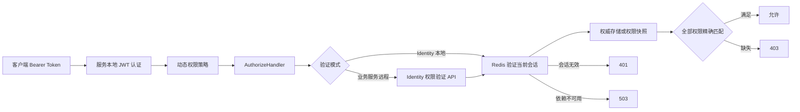

# BuildingBlocks.Authorization

`BuildingBlocks.Authorization` 是不依赖 Redis 的授权核心类库，负责 JWT 令牌生成契约、当前用户上下文、权限定义、动态授权策略、本地/远程权限验证和统一失败响应。Identity 与业务服务都引用此项目；只有 Identity 额外引用 `BuildingBlocks.Authorization.Redis`。

项目名称使用 `Authorization`，为保持现有调用方兼容，根命名空间继续使用 `BuildingBlocks.Authentication`。不要在本组件维护任务中改名或复制一套新命名空间。

## 用途与边界

- Identity：本地验证当前会话和权威权限，签发访问令牌与刷新令牌。
- 业务服务：本地完成 JWT Bearer 认证，再把原始 Bearer Token 和所需权限转发给 Identity 验证。
- 权限定义：声明服务可识别的权限树，启动时生成不可变清单。
- 授权策略：把 `ZAuthorizeAttribute` 中的权限名称解析为动态策略。
- 错误响应：把认证、权限和依赖故障分别映射为 401、403 和 503。
- 不负责：Redis 连接、会话键、权限快照缓存、分布式锁、用户权限数据库实现或业务权限常量。

业务服务不得引用 `BuildingBlocks.Authorization.Redis`，也不得直接读取 Identity 数据库或授权 Redis。

## 目录与依赖

| 目录 | 职责 |
| --- | --- |
| `Abstractions` | 会话验证、权限缓存、权限存储、同步、JWT Provider 和远程验证 DTO 契约 |
| `Contexts` | 从当前 `ClaimsPrincipal` 提取用户标识、账号和角色的内部实现 |
| `Extensions` | 核心授权、本地验证、远程验证和权限提供程序的注册入口 |
| `Options` | `OAuthOptions` 与 `PermissionAuthorizationOptions` |
| `Permissions` | 权限定义、权限清单和本地/远程权限检查 |
| `Policies` | 动态 Policy Provider、Handler、Attribute 和失败响应 |
| `Tokens` | JWT Provider、令牌 SHA-256 摘要和 Claim 常量 |

直接依赖包括 ASP.NET Core、JWT Bearer、`Newtonsoft.Json` 和核心 `BuildingBlocks`。项目启用 `GenerateDocumentationFile`，公开 API 的 XML 注释会随程序集生成。

## 注册

### 所有服务的公共注册

```csharp
using BuildingBlocks.Authentication;

builder.RegisterAuthorization();
builder.Services.AddPermissionDefinitionProvider<FantasyPermissionDefinitionProvider>();
```

`RegisterAuthorization()` 注册动态策略、授权 Handler、统一结果处理器、JWT Provider、用户上下文和权限定义管理器，但不会选择权限数据源。每个服务还必须在下面两种模式中选择一种。

### Identity：本地权限验证

Identity 需要先注册缓存和授权核心，再注册 Redis 适配层，最后注册权威权限存储：

```csharp
builder.Services.AddCaching(builder.Configuration);
builder.RegisterAuthorization();
builder.AddAuthorizationRedis();
builder.Services.AddLocalPermissionValidation<IdentityUserPermissionStore>();
```

`IdentityUserPermissionStore` 由 Identity 实现 `IUserPermissionStore`，从权威存储取得当前用户完整权限集合。Redis 适配层的详细配置和注册约束见相邻项目的 `README.md`。

### 业务服务：Identity API 远程验证

```csharp
builder.RegisterAuthorization();
builder.Services.AddIdentityApiPermissionValidation();
```

远程验证器只转发语法有效且参数非空的 Bearer Header。缺失请求头、非 Bearer 方案或空 Token 会在本地判为无效会话，不会发起内部 HTTP 请求。业务服务仍需先配置 ASP.NET Core JWT Bearer 认证。

## 权限定义与使用

权限定义提供程序只声明当前服务可识别的权限：

```csharp
using BuildingBlocks.Authentication.Permissions;

public sealed class FantasyPermissionDefinitionProvider : PermissionDefinitionProvider
{
    public override void Define(PermissionDefinitionContext context)
    {
        var vocabulary = context.CreatePermission(
            "Vocabulary",
            "词汇",
            "词汇权限分组");

        vocabulary.CreateChildPermission(
            "Vocabulary.Read",
            "读取词汇",
            "允许读取词汇数据");
    }
}
```

在控制器、端点类或方法上声明权限：

```csharp
using BuildingBlocks.Authentication.Policies;

[ZAuthorize("Vocabulary.Read")]
public static Task<IResult> HandleAsync(CancellationToken cancellationToken)
{
    // ...
}
```

`ZAuthorizeAttribute` 的多个权限采用 AND 语义，调用方必须同时拥有全部权限。无参数特性只验证身份认证和当前会话。

权限安全规则：

1. 权限名称使用 `StringComparer.Ordinal` 精确、区分大小写匹配。
2. 权限树的父子关系仅用于组织和展示；授予 `Vocabulary` 不会隐式授予 `Vocabulary.Read`。
3. 子权限也不会反向授予父权限。
4. 未注册权限先被拒绝，再判断管理员角色；管理员不能绕过未知权限。
5. 重复权限名称会在构建权限清单时抛出异常，避免含糊策略进入运行时。

## 配置 API

### OAuthOptions

配置节为 `OAuthOptions`：

```json
{
  "OAuthOptions": {
    "Issuer": "fantasy-identity",
    "Audience": "fantasy-services",
    "ExpireMinute": 30,
    "RefreshExpireMinute": 10080,
    "ValidateIssuer": true,
    "ValidateAudience": true,
    "ValidateLifetime": true,
    "RequireHttpsMetadata": true,
    "ClockSkew": "00:01:00"
  }
}
```

| 属性 | 用途与安全要求 |
| --- | --- |
| `Issuer` / `ValidIssuers` | 访问令牌签发方及可接受签发方集合 |
| `Audience` / `ValidAudiences` | 目标受众及可接受受众集合 |
| `Secret` | HMAC 对称签名密钥；只从环境变量、用户机密或部署平台密钥管理注入 |
| `ExpireMinute` | 访问令牌有效期（分钟） |
| `RefreshExpireMinute` | 刷新令牌有效期（分钟） |
| `ValidateIssuer` | 是否验证签发方；生产保持开启 |
| `ValidateAudience` | 是否验证受众；生产保持开启 |
| `ValidateLifetime` | 是否验证令牌有效期；生产保持开启 |
| `Authority` | 外部元数据地址；生产使用受信任 HTTPS 地址 |
| `RequireHttpsMetadata` | 是否要求 Authority 使用 HTTPS；生产保持开启 |
| `ClockSkew` | 时间声明允许偏差；值越大，接受过期令牌的窗口越长 |

示例故意不包含 `Secret`。当前 Provider 使用 HMAC SHA-256；共享对称密钥意味着所有验证方都必须保护该密钥，后续迁移到非对称签名应作为独立兼容任务处理。

### PermissionAuthorizationOptions

```json
{
  "PermissionAuthorizationOptions": {
    "AdministratorRole": "admin",
    "IdentityApiBaseAddress": "https+http://fantasy-identity-api",
    "IdentityApiValidationPath": "/api/v1/identity/permissions/validate"
  }
}
```

| 属性 | 用途 |
| --- | --- |
| `AdministratorRole` | 已注册权限的管理员旁路角色；未知权限仍拒绝 |
| `IdentityApiBaseAddress` | 业务服务调用 Identity 的绝对基础地址，可使用 Aspire 服务发现地址 |
| `IdentityApiValidationPath` | Identity 权限验证端点相对路径，必须以 `/` 开头 |

注册时会验证基础地址为绝对 URI、验证路径以 `/` 开头，并在启动阶段失败，而不是带着无效配置运行。

## JWT 与令牌哈希

`IJwtTokenProvider.GenerateAccessToken` 写入用户 `Sid`、角色和调用方提供的附加 Claim，并依据当前 `OAuthOptions` 生成 JWT。`GenerateRefreshToken` 使用 32 字节密码学安全随机数生成 Base64 刷新令牌。

`AuthorizationTokenHasher.Hash` 对 UTF-8 令牌计算 SHA-256，并返回大写十六进制摘要。会话持久化和刷新令牌索引只能保存摘要，不能保存、记录或输出明文令牌。SHA-256 摘要用于高熵随机令牌的等值索引，不用于用户密码哈希。

## 授权流程



`AccessTokenValidationResult` 和 `PermissionValidationResult` 分别携带会话状态、依赖可用性和缺失权限，避免把基础设施故障伪装成普通无权限。

## 错误语义与关闭式失败

| HTTP 状态 | 条件 | 客户端处理 |
| --- | --- | --- |
| `401 Unauthorized` | JWT 未认证、Bearer Header 无效、用户标识无效或 Token 已不是当前会话 | 重新认证或刷新会话，不应重试原权限请求 |
| `403 Forbidden` | 会话有效，但缺少一个或多个已注册权限 | 不要自动刷新 Token；提示权限不足 |
| `503 Service Unavailable` | Identity、授权 Redis、同步锁或远程权限验证依赖不可用 | 可按受控退避策略重试并告警 |

授权依赖异常必须关闭式失败：不得放行请求，不得把 503 转成 403，也不得吞掉调用方主动取消。统一结果处理器把失败写为项目通用 `ResultDto` JSON 包络。

## 缓存与同步契约

核心项目只定义 `IAuthorizationCache`、`IPermissionCache` 和 `IAuthorizationSynchronization`，不提供 Redis 实现：

- `IAuthorizationCache` 保存带绝对过期时间的分布式授权数据。
- `IPermissionCache` 保存用户完整权限快照，包括空集合；`null` 表示未命中或读取失败。
- `IAuthorizationSynchronization` 串行化同一授权资源的会话切换、缓存填充和缓存失效。
- 权限变更应先使旧快照失效；失效失败时中止写入，防止多实例继续读取旧权限。

具体 Redis 键、默认 TTL、锁超时、异常和注册顺序由 `BuildingBlocks.Authorization.Redis` 定义。

## 主要公共 API

- `IJwtTokenProvider`、`IAccessTokenValidator`、`IPermissionCheck`、`IUserPermissionStore`
- `IAuthorizationCache`、`IPermissionCache`、`IAuthorizationSynchronization`
- `PermissionValidationRequest`、`PermissionValidationResult`、`AccessTokenValidationResult`
- `PermissionDefinition`、`PermissionDefinitionProvider`、`PermissionDefinitionContext`
- `IPermissionDefinitionManager`、`ZAuthorizeAttribute`、`AuthorizeRequirement`
- `OAuthOptions`、`PermissionAuthorizationOptions`
- `AuthorizationTokenHasher`、`UserInfoConst`
- `AuthorizationExtensions`

Policy Handler、权限检查器、JWT Provider 和用户上下文的具体实现为内部类型，由扩展方法注册，不作为稳定公共实现 API。

## 限制

- 当前 JWT Provider 使用共享对称密钥，不提供密钥轮换或非对称签名。
- 业务服务的远程权限验证同步依赖 Identity 可用性。
- 单元测试和构建不能证明真实 Redis、多副本缓存一致性、会话切换或故障恢复。
- Redis 适配层的分布式锁仅保护短临界区，不是通用事务或 Redlock 实现。
- 内部权限验证端点必须限制在受信任服务网络，并配合服务间身份或网络策略。

## 构建与测试

```powershell
dotnet build src\BuildingBlocks\BuildingBlocks.Authorization\BuildingBlocks.Authorization.csproj --no-restore
dotnet build src\BuildingBlocks\BuildingBlocks.Authorization.Redis\BuildingBlocks.Authorization.Redis.csproj --no-restore
dotnet test src\BuildingBlocks\BuildingBlocks.Authorization.Tests\BuildingBlocks.Authorization.Tests.csproj --no-restore
dotnet build src\Fantasy.slnx --no-restore
git diff --check
```

发布前还应在真实 Aspire 或部署环境验证登录、并发刷新、登出、旧 Token 失效、赋权/撤权、多实例缓存一致性，以及 Redis/Identity 故障下的 401、403、503 语义。